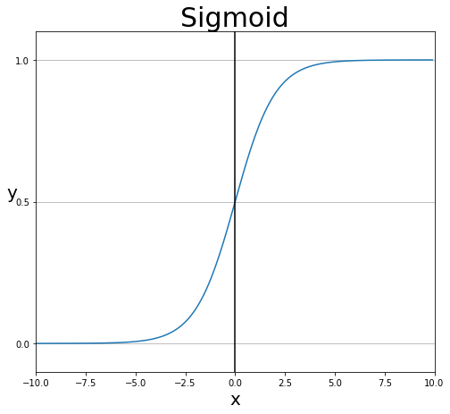

# 3장. 딥러닝을 위한 기초수학

> **1. 일차함수, 기울기와 y절편**
>
> 함수 : 두 집합 사이의 관계를 설명하는 개념
>
> 일차 함수 : y를 x에 관한 일차식으로 표현한 경우
>
> 일차 함수의 예시, $y = ax + b$
>
> ✅ x값이 증가할 때, y값이 어느 정도 증가하는지에 따라 그래프의 기울기 a가 정해짐
>
> ✅ x가 주어지고, 원하는 y값이 있을 때, 적절한 a와 b를 찾는 방식
>
> ✅ 딥러닝을 설명하는 가장 간단한 표현

---

> **2. 이차 함수와 최솟값**
>
> 이차 함수 : y를 x에 관한 이차식으로 표현한 경우
>
> 이차 함수의 예시는 아래의 공식과 같다.
>
> $y = ax^2 (a \neq 0)$
>
> ✅ a > 0 이면, 아래로 볼록한 그래프
>
> ✅ $y = a(x-p)^2 + q$ 는, 위의 그래프를 x축 방향으로 p, y축 방향으로 q 만큼 이동한 그래프
> 점 p와 q를 꼭짓점으로 하는 포물선에서 최솟값은 맨 아래에 위치한 지점이 되며,
> 딥러닝 실행 시 이러한 최솟값을 찾아내는 과정이
> 중요하다.
>
> ✅ 최솟값은 ‘최소제곱법’으로 쉽게 알아낼 수 있지만, 실제 딥러닝 문제에서는 최소제곱법에 반드시 필요한 조건들을 알아내기 어렵기 때문에, 미분과 기울기를 이용해야한다.

>

---

> **3. 미분, 순간 변화율과 기울기**
>
> 미분 : 딥러닝 이해를 위한 가장 중요한 원리 (이차함수의 포물선에서 최솟값을 찾기 위한 방법)
>
> 순간 변화율 : a 값이 미세하게 0에 가까워지면, y값 또한 미세하게 변화할 것이고, 너무 미세하여 실제 움직이는 것이 아니라, 방향만 드러내는 정도의 순간적인 변화만 있을 것이므로 이 순간의 변화를 순간 변화율이라고 한다.
>
> 기울기 : 순간 변화율은 어느 쪽을 향하는 방향성을 지니고 있으므로, 이 방향을 따라 직선을 그어주면 그래프와 맞닿는 접선이 그려지고, 이 선이 해당 점에서의 기울기이다.
>
> 미분 계수 : 미분을 한다는 것은, ‘순간 변화율’을 구한다는 의미이다. 어느 순간에 어떤 변화가 일어나고 있는지 숫자로 표현한 것이 ‘미분 계수’ 이며, 그래프에서의 ‘기울기’를 의미한다.
>
> 기울기가 중요한 이유는,
> 기울기가 0일 때, 즉 x축과 평행한 직선으로 그어질 때가 그래프에서 최솟값인 지점이 되기 떄문이다.
>
> ✅ 미분은,
> $f'(x) = \lim_{\triangle x \to 0} \cfrac{f(a+\triangle x) - f(a)}{\triangle x}$
>
> 함수 f(x)를 x로 미분하는 것이며, x의 변화량이 0에 가까울 만큼 작을 때, y의 변화량을 x의 변화량으로 나누어 ‘순간 기울기’를 구하라는 의미이다.

>

---

> **4. 편미분**
>
> 다변수 함수에서 순간변화율(평균변화율의 극한값)을 정의할 때 문제가 생긴다. 예로 이변수 함수의 특정 점을 기준으로 변화율을 계산할 때, 어느 방향으로 움직였느냐에 따라 평균변화율이 달라진다. 이래서는 순간변화율을 정의할 수 없다.
>
> 그러나, 다변수함수 미분시엔 '편미분'을 통해 기존 일변수 스칼라함수 처럼 손쉽게 계산할 수 있게 할 수 있다. 다른 변수는 고정하고 나머지 변수에 대한 순간변화율을 계산하는 것.

---

> **5. 지수와 지수 함수**
>
> 지수 : a를 x만큼 반복하여 곱한다는 의미이며, 아래의 공식과 같다.
>
> $y = a^x$ $(a \neq 1, a > 0)$\*\*

>

---

> **6. 시그모이드 함수**
>
> 딥러닝의 내부를 보면, 입력받은 신호를 얼마나 출력할지 계산하는 과정이 무수히 반복된다.
> 이 때, 출력 값으로 얼마나 내보낼지를 계산하는 함수를 활성화 함수라고 한다.
>
> 시그모이드 함수는 지수 함수에서 밑 값이 자연 상수 $e$ 인 함수를 의미하며, 자연 상수 $e$ 는 파이 $\pi$ (파이) 와 같은 무리수이며, 값은 대략 2.718…. 이다. 자연 상수 $e$ 가 지수 함수에 포함되어 분모에 들어가면 시그모이드 함수가 되며, 식으로 표현하면 아래와 같다.
>
> $f(x) = \cfrac{1}{1+e^{-x}}$

> 
>
> ✅ 시그모이드 함수는 0에서 1 사이의 함수이며, 값이 들어왔을 때, 0~1 사이의 값을 반환한다.
>
> ✅ 연속형 데이터이기 때문에 계단 함수가 끊기지 않는 매끄러운 모양으로 바뀐 것을 알 수 있다.
>
> ✅ 동시에 이상치가 들어온다 할지라도, 시그모이드 함수는 0과 1에 수렴하므로, 이상치 문제도 해결하면서, 연속된 값을 전달할 수 있다.
>
> ✅ 시그모이드 함수를 활성화 함수로 사용하면, 0과 1에 가까운 값을 통해 **이진 분류**를 할 수 있다.

---

> **7. 로그와 로그 함수**
>
> 로그 : 지수 함수 공식인, $a^x = b$ (a를 x만큼 거듭제곱한 값이 b이다.) 에서, a와 b를 알고 있을 때 x를 구하기 위한 방법으로 아래의 공식과 같다.
>
> $y = log_ax$
>
> x축에 대해 이동한 경우, 아래와 같다.
>
> $y = -log_ax$
>
> x축과 y축에 대해 대칭 이동한 경우, 아래와 같다.
>
> $y = -log_a(-x)$
>
> 위의 x축과 y축에 대해 대칭 이동한 그래프를,
> x축 오른쪽 방향으로 1만큼 평행 이동한 경우, 아래와 같다.
>
> $y = -log_a(1-x)$
>
> ✅ 지수와 로그는 역함수의 관계이다.
> 로지스틱 회귀에서, x가 1에 가까워지거나 0에 가까워질수록 오차가 커지는 그래프가 필요하며, 이러한 그래프를 만들기 위해 위의 로그 함수를 x축 또는 y축으로 대칭 이동하거나 평행이동을 한다.

>
